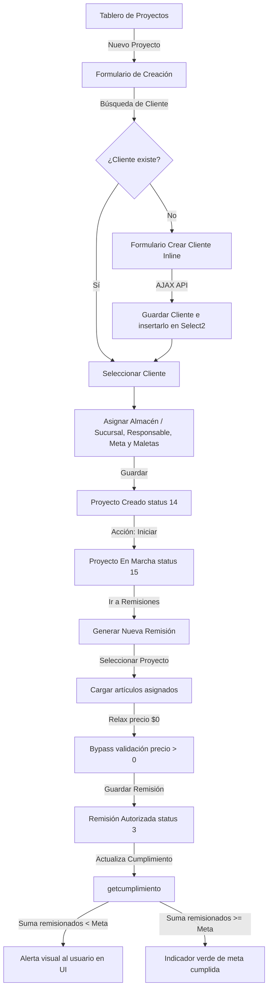

# Documentación de Flujo y Estructura del Módulo "Proyectos"

Este documento detalla el diseño de base de datos, arquitectura de software, flujos de trabajo e integraciones implementadas para el nuevo módulo de **Proyectos** en el sistema AMPAR v3.

---

## 1. Introducción y Racional de Diseño

El módulo de **Proyectos** se ubica en el menú lateral directamente debajo de **Eventos**. Aunque comparte características con un evento (como la asignación de maletas, equipos y vinculación de remisiones), un proyecto tiene las siguientes diferencias clave:
* **Duración prolongada**: A diferencia de los eventos convencionales, no se cierra automáticamente al generar su primera remisión.
* **Múltiples Remisiones**: Permite asociar cualquier número de remisiones a lo largo de su ciclo de vida.
* **Control de Cumplimiento**: Define una meta de cumplimiento ($N$ artículos que deben ser remisionados para mantener el proyecto en marcha). Si la cantidad enviada es menor, el sistema alerta visualmente al usuario.
* **Flexibilidad de Costos**: Admite equipo capital con precio de $0.00 pesos debido a políticas contractuales/comodato.
* **Responsable Interno**: Cada proyecto está a cargo de un usuario registrado en el sistema (seleccionado del catálogo de usuarios).
* **Gestión Dinámica de Clientes**: Integración de un botón "+ Nuevo Cliente" que lanza un formulario secundario directo para dar de alta un cliente sin abandonar el flujo del proyecto.

---

## 2. Estructura de Base de Datos (Firebird SQL)

Se definieron las siguientes estructuras para dar soporte al módulo:

### A. Tabla `AMPAR_HIS_PROYECTOS`
Almacena los datos maestros del proyecto.
* `PROYECTO_ID`: Identificador único autoincrementable.
* `PROYECTO_FOLIO`: Folio de identificación único generado automáticamente (ej: `PRY-00001-26`).
* `PROYECTO_SUCURSALID`: Sucursal a la que pertenece el proyecto (restringe la visualización a los usuarios de la sucursal).
* `PROYECTO_FECHACREACION`: Fecha y hora de registro.
* `PROYECTO_FECHAI` / `PROYECTO_FECHAF`: Vigencia de inicio y fin.
* `PROYECTO_CONCEPTO`: Concepto o descripción general del proyecto.
* `PROYECTO_CLIENTEID`: Llave foránea hacia la tabla `CLIENTES`.
* `PROYECTO_RESPONSABLEID`: Llave foránea hacia la tabla `AMPAR_CAT_USUARIOS`.
* `PROYECTO_CUMPLIMIENTO`: Cantidad meta de artículos remisionados.
* `PROYECTO_STATUSGENERAL`: Estatus del proyecto (14 = Creado, 15 = En marcha, 3 = Finalizado, 5 = Cancelado).

### B. Tabla `AMPAR_HIS_PROYECTOSMALETAS`
Tabla asociativa intermedia para asignar múltiples maletas y/o equipos capital a un proyecto.
* `PROYECTOMALETA_ID`: Llave primaria autoincrementable.
* `PROYECTOMALETA_PROYECTOID`: Referencia a `AMPAR_HIS_PROYECTOS`.
* `PROYECTOMALETA_MALETAID`: Referencia al ID del almacén (maleta) o el ID negativo (equipo capital) asociado.

### C. Columna `REMISION_PROYECTOID` en `AMPAR_HIS_REMISIONES`
Columna agregada a la tabla de remisiones para vincular directamente la remisión a un proyecto en lugar de un evento tradicional.

---

## 3. Estructura de Archivos (Arquitectura de Código)

La implementación se diseñó siguiendo el patrón arquitectónico del sistema actual, dividiéndose en tres capas bien definidas:

### Capa de Modelo / Datos
* **[class/proyectos.php](file:///c:/laragon/www/amparv3/class/proyectos.php)**: Contiene la clase `proyectos` con los métodos necesarios para:
  * `getproyectos()`: Listar proyectos filtrados por sucursal y estatus general.
  * `getproyectobyid()`: Obtener la ficha técnica de un proyecto y sus maletas asociadas.
  * `nuevoproyecto()`: Registrar un proyecto, autogenerar su folio, asociar maletas e insertar la acción en bitácora.
  * `editarproyecto()`: Guardar cambios de cabecera y actualizar la lista de maletas.
  * `updatestatus()`: Cancelar o cerrar/finalizar proyectos.
  * `getcumplimiento()`: Calcular la suma de artículos enviados en remisiones autorizadas y compararlo contra la meta.
  * `getarticulosbyproyecto()`: Listar todos los artículos físicos contenidos en las maletas y equipos asignados al proyecto.

### Capa de Controladores (AJAX)
* **[ajax/proyectos.nuevo.php](file:///c:/laragon/www/amparv3/ajax/proyectos.nuevo.php)**: Recibe el formulario de creación y llama a `nuevoproyecto()`.
* **[ajax/proyectos.editar.php](file:///c:/laragon/www/amparv3/ajax/proyectos.editar.php)**: Recibe los cambios y llama a `editarproyecto()`.
* **[ajax/proyectos.update.status.php](file:///c:/laragon/www/amparv3/ajax/proyectos.update.status.php)**: Cambia el estatus del proyecto (Iniciar/Finalizar/Cancelar).
* **[ajax/get.proyectos.remision.php](file:///c:/laragon/www/amparv3/ajax/get.proyectos.remision.php)**: Endpoint de autocompletado para el buscador en Remisiones.
* **[ajax/get.articulosbyproyecto.php](file:///c:/laragon/www/amparv3/ajax/get.articulosbyproyecto.php)**: Carga los artículos de las maletas del proyecto para remisionar.

### Capa de Vistas y Modales (UI)
* **[gui/proyectos.php](file:///c:/laragon/www/amparv3/gui/proyectos.php)**: Tablero principal del módulo. Muestra las pestañas de proyectos (Creados, En marcha, Finalizados, Cancelados) y el estado de cumplimiento individual de cada uno.
* **[includes/proyectos.nuevo.php](file:///c:/laragon/www/amparv3/includes/proyectos.nuevo.php)**: Modal del formulario de creación. Contiene los selects inteligentes y el sub-modal inline `#mdlCrearCliente` para dar de alta clientes rápidamente.
* **[includes/proyectos.editar.php](file:///c:/laragon/www/amparv3/includes/proyectos.editar.php)**: Modal del formulario de edición.
* **[includes/proyectos.info.php](file:///c:/laragon/www/amparv3/includes/proyectos.info.php)**: Modal informativo del proyecto. Presenta el avance de la meta, un banner alertando si el cumplimiento no se ha alcanzado y la tabla de todas las remisiones ligadas al proyecto.

---

## 4. Flujo de Trabajo

### Integración en Nueva Remisión
1. **Toggle de Selección**: Al crear una remisión, el usuario selecciona mediante radio buttons si desea vincularla a un **Evento** o un **Proyecto**.
2. **Búsqueda Dinámica**: El buscador general `#remevento` cambia dinámicamente sus fuentes de datos. Si se elige **Proyecto**, busca proyectos activos de la misma sucursal; si se elige **Evento**, realiza su búsqueda tradicional.
3. **Carga de Artículos**: Carga los artículos de las maletas asignadas al proyecto.
4. **Relax de Precios**: El validador javascript de precio mayor a cero se relaja, admitiendo artículos con costo de `$0.00` pesos.
5. **Guardado**: Al guardar, se vincula mediante `REMISION_PROYECTOID` y se preserva el estatus de marcha del proyecto para que pueda recibir más remisiones futuras.
